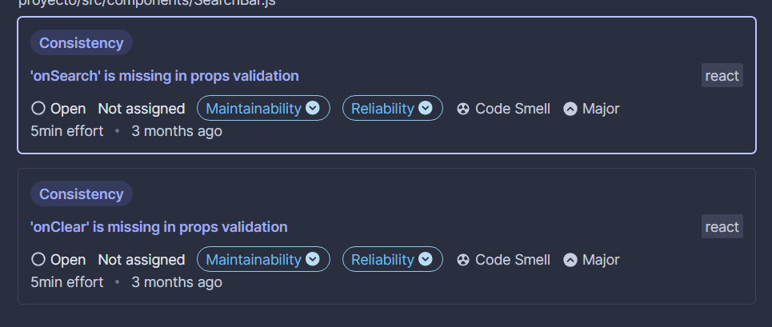
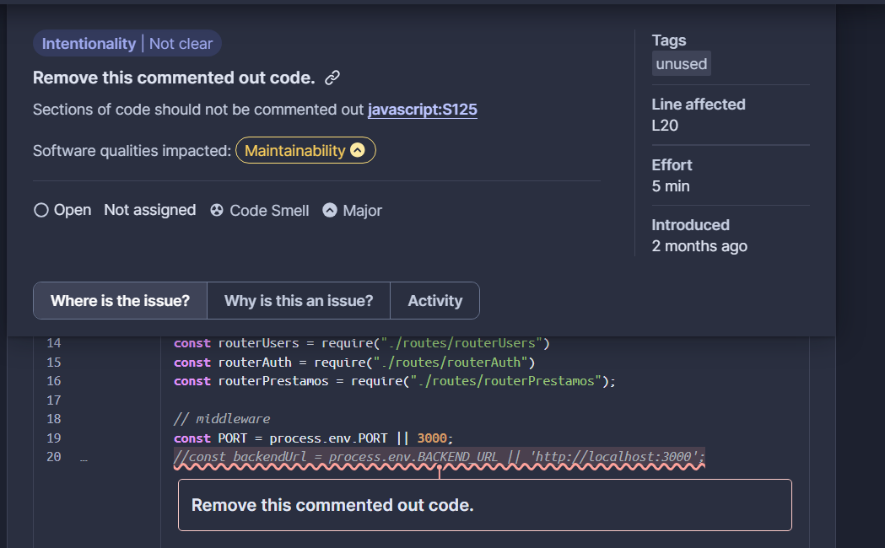

Los quality issues seleccionados fueron los siguientes:

Estos problemas fueron seleccionados debido a que están estrechamente relacionados, aportan mantenibilidad y se presentan en múltiples HU, siendo así, un problema transversal a través de nuestro proyecto. Consideramos que otros issues no tenían la misma relevancia o simplemente no eran issues. Por ejemplo, el siguiente caso:

El cual se considera "ruido" dentro del código. Sin embargo, debido a que estamos en un entorno de aprendizaje, se considera relevante explicar segmentos de código y asegurar el completo entendimiento del programa. Concluyendo que este es un falso positivo.
